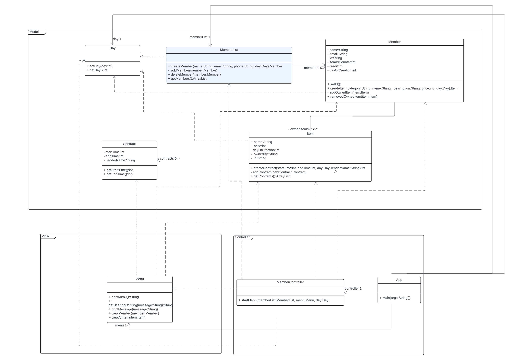
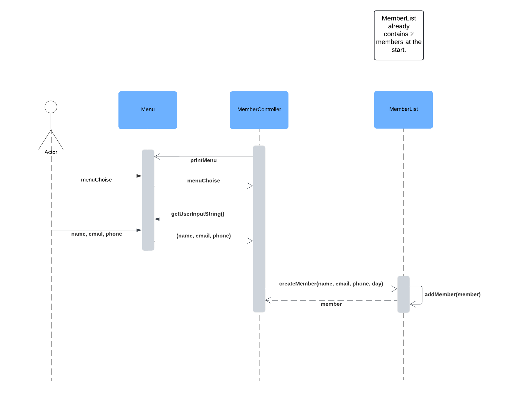
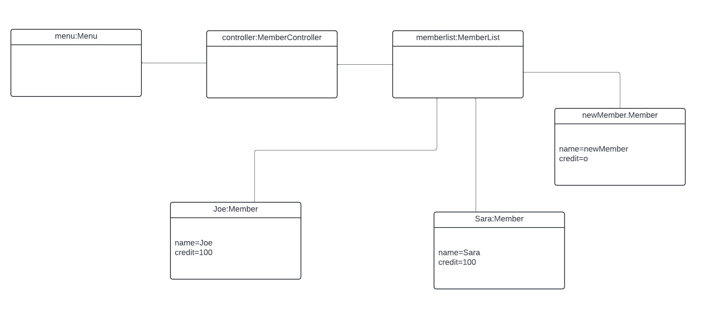

# Stuff Lending System OO-Design
This document describes the design according to the requirements presented in assignment 2.

## Architectural Overview
The application uses the model-view-controller (MVC) architectural pattern. The view is passive and gets called from the controller. The view may only read information from the model, not directly change it.

## Detailed Design
### Class Diagram

MemberList has none or many Members.  
Member has none or many Items.  
Items has none or many Contracts.  
MemberList, Member and Item has a dependency to Day because it takes day as an argument.  

App has a MemberController, a Menu, a Day and a MemberList therefore the association. It passes those arguments to MemberController so MemberController has a dependency to Menu, Day and MemberList. It also has a dependeny to Member and Item.

Menu prints out information from Member, Item and Contract therefore it has a dependency to them.  

All dependencies goes in to the model and none goes out.

### Sequence Diagram
  
The sequence shows how a member is created and saved in to MemberList. Before the sequence starts there are already two Members in the system which can be seen in the object-diagram below.

### Object Diagram
